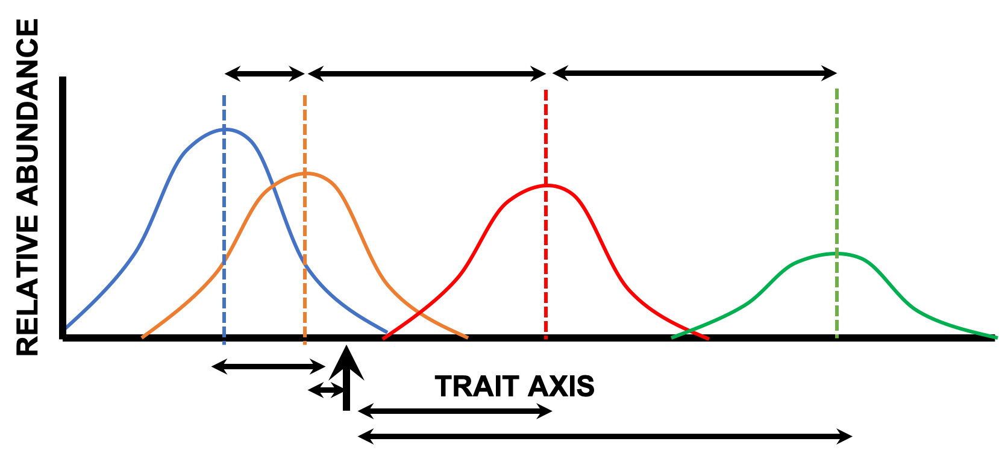

```{r setup, echo = FALSE}
knitr::opts_chunk$set(
  comment = "#",
  echo = F,
  collapse = TRUE,
  warning = FALSE,
  message = FALSE,
  cache = TRUE,
  fig.width=5, fig.height=5, 
  fig.retina=3,
  fig.align = 'center'
)
options(repos=structure(c(CRAN="http://cran.r-project.org")))
```


# About me: Gabriel Muñoz  

**Quantitative Ecologist**

**Macroecology** 

**Ph.D. candidate** in Biological Sciences @Concordia University

- Supervisor Dr. J.P. Lessard 


**M.Sc. Biology**, *track* Ecology and Evolution @University of Amsterdam, NL

**B.Sc. Biology**  @Universidad San Francisco de Quito, EC


```{r, out.width='30%', fig.align='center', fig.cap=''}
knitr::include_graphics('images/Lab Logo.png')
```


---
# Learning objectives:

<br>


**Quantify variation in functional trait diversity along environmental gradients** 


<br>

## Lecture structure 

1) Functional Ecology (~20min)

2) Redundancy Analysis (RDA) (~15min)

3) Case study (~30 min)

<br>

.alert[You can stop me anytime for questions]


---
class: inverse, center, middle
# 1. Functional Ecology

---
# The diversity of lifeforms and climates 

```{r, out.width='80%', fig.align='center', fig.cap=' Flooded forests in Cuyabeno, Sucumbios Ecuador'}
  
```
---
# The diversity of lifeforms and climates 


```{r, out.width='80%', fig.align='center', fig.cap='Ceibo-Manabí, Ecuador'}
  
```
---
# The diversity of lifeforms and climates  
```{r, out.width='80%', fig.align='center', fig.cap='Lenga forest, El Chalten, Patagonia, Argentina'}
  knitr::include_graphics('images/lengaPatagonia.JPG')
```


---
# The diversity of lifeforms and climates  
```{r, out.width='80%', fig.align='center', fig.cap='Atacama desert, Chile'}
  knitr::include_graphics('images/Atacama.JPG')
```

---
# The dimensions of biodiversity

```{r, echo  = F, out.width="70%"}
vec <- replicate(3,sample(1:100, 80))


scatterplot3d::scatterplot3d(vec, 
                             ylab = "Taxonomic",
                             zlab = "Functional",
                             xlab = "Genetic", 
                             pch = 16,
                             highlight.3d = T,
                             box = T, grid = F)
```
---
# Species traits 

.alert[Traits: species unique characteristics]

- **Traits that allows species to live where they live**

- Traits that allow species to interact with others

- Traits that influence the impact of a species in the ecosystem

```{r, out.width='40%', fig.align='center', fig.cap=''}
  
```

.alert[Functional diversity]

---
# The ecological niche 

.alert[Niche: The relative positioning of species in a ecological space]

- Grinnellian niche view: Species environmental tolerances (physiological requirements)


```{r, out.width='60%', fig.align='center', fig.cap='Drosophila growth, Bozinovic et al., 2011'}
  
```


---
# The ecological niche 

.alert[Niche: The relative positioning of species in a ecological space]


- Eltonian niche view : Biotic dimensions (species interactions)


```{r, out.width='80%', fig.align='center', fig.cap='Finch radiation'}
  
```

---
# The ecological niche 

.alert[Niche: The relative positioning of species in a ecological space]

- Hutchinson: n-dimensional hypervolume (both Env + Int)

```{r, out.width='60%', fig.align='center', fig.cap='High dimensional volume'}
  
```


.alert[!Neutral theory of biodiversity: All species are equivalent]

---
# Niche-based assembly processes 


.alert[.small[Ecological communities: 
Sets of interacting species within a
considerable area of space and period of time  ]]

.alert[Deterministic processes]

- Species sorting / Limiting similarity principle 

- Fundamental and realized niches


```{r, out.width='50%', fig.align='center', fig.cap=''}
  
```


---
#  The composition of biotas across environmental gradients 


```{r, out.width='50%', fig.align='center', fig.cap='Whittaker plot'}
  
```

---
# Funtional diversity, a driver of innovation in Community Ecology 


Species functional traits --> ** Phenotypes reflecting species adaptations to their ecological niches**

- Allow testing more mechanistic hypothesis in community assembly 

- Relate species functions to climatic variation 

- Identify transition zones 

- Predict consequences of global climate changes in biodiversity

---
# Functional diversity, the knowledge gap

- Global trait databases

- Species responses to global change


https://www.try-db.org/TryWeb/Home.php


```{r}
  knitr::include_graphics('images/plantTraits.png')

```


---
# Calculating functional diversity: Functional position (identity)


$$CWM = \dfrac{\sum_{i = 1}^{n} (x_i \times w_i)}{ \sum_{i = 1}^{n} (w_i)}$$


```{r, out.width='90%', fig.align='center', fig.cap=''}
  
```

---
# Calculating functional diversity: Functional range


$$T_{max} - T_{min}$$ 


```{r, out.width='90%', fig.align='center', fig.cap=''}
  knitr::include_graphics('images/range.png')

```


---
# Calculating functional diversity: Functional dispersion 

$$ SD(\{d_i,\cdots, d_i\}) $$ 

```{r, out.width='90%', fig.align='center', fig.cap=''}
  
```


---
# Inferring niche-based assembly processes with functional diversity changes along gradients 


```{r, out.width='80%', fig.align='center', fig.cap=''}
  
```


---
class: inverse, center, middle

## Redundancy analysis (RDA)


---
# Ordinations

- Useful to represent the variance-covariance of multidimensional datasets

- Techniques to reduce dataset dimensionality into fewer synthetic variables 

- Descriptive of data-structure (Unconstrained)

- e.g. Principal Component Analysis 


.pull-left[
```{r,echo=FALSE}
df <- data.frame("A" = sample(1:100, 20), 
                "B"= sample(1:100, 20),
                "C"= sample(1:100, 20),
                "D" = sample(1:100, 20),
                "E"= sample(1:100, 20))

plot(df, 
     pch = 21, bg = "red")
```

]


.pull-right[
```{r,echo=FALSE, out.width="80%"}
biplot(vegan::rda(df), scaling = 3, type  = "text" )
```

]


---
# Canonical Analysis


- Method first described by Rao (1964)
 
 
```{r, out.width='70%', fig.align='center', fig.cap=''}
  
```


---
# Canonical Analysis


- Finds relationships between response and predictor matrices 

- *Y* = Sites x Species | *X* = Sites x Environmental variables 

- RDA | CCA 

```{r, out.width='60%', fig.align='center', fig.cap=''}
  
```


---
#  Redundancy analysis (RDA)


- RDA - Redundancy analysis:

- Combines multivariate linear regression and ordinations 

- How much variance of in Y can be explained by the variance in X

```{r, out.width='60%', fig.align='center', fig.cap=''}
  
```

---
# Redundancy analysis: Important considerations

- Independence of observations 

- Linear relationships between Y~X 

- No multicolinearity 
  - Plots and variance inflation factors, evaluate the need for transformation 
  - Rare species are removed 

- (# sites >> # predictors) 

---
# Redundancy analysis: Underlying mechanics 

- 2 step process 

- First multivariate regression, then PCA on fitted values 

- Fits Y table to the linear combination of environmental variables 

```{r, out.width='30%', fig.align='center', fig.cap=''}
  knitr::include_graphics('images/constrained_ord_diagram.png')
```

---
# Redundancy analysis: Interpreting results

```{r, out.width='30%', fig.align='center', fig.cap=''}
  
```


- 2 scalings

1: Similarities between objects 

2: Correlation among variables

---
# Redundancy analysis: Important technical questions

- How many axes are required? 

- Hypothesis test, by permutations?

- How many variables are needed?

- How important are my different variables? 

- Which scaling report? 

---
class: inverse, center, middle

## Case study: Relating species characteristics to their environment-Redundancy analysis (RDA)

---
# Case study: The geography of China


```{r, out.width='80%', fig.align='center', fig.cap=''}
  
```

---
# Case study: The China Plant Trait Database


```{r,out.width='80%',fig.align='center', fig.cap=''}

```

---
## Case study: The China Plant Trait Database

```{r, echo = F, message=FALSE}
library(vegan)

# Preparing data 

SitesTab <- read.csv("China_Plant_TraitsDB_csv/Sites.csv")
SpTraits <- read.csv("China_Plant_TraitsDB_csv/Hard Traits.csv")
Climate <- read.csv("China_Plant_TraitsDB_csv/High-res climate.csv")
Site_Species <- read.csv("China_Plant_TraitsDB_csv/Species translations.csv")
```


```{r}
names(SpTraits)
names(SitesTab)
```


```{r, echo = F}
plot(Latitude~ 
       Longitude, 
     frame = F,
     pch = 16,data = SitesTab)
maps::map("world",add =T)
maps::map.cities(country = "China",
                 capitals = 1, 
                 label = T, pch = "")

legend("bottomleft", 
       pch =16,
       legend = "sampling location")
```


---
## Case study: The China Plant Trait Database

How many species are in the dataset? 

```{r, echo = F}
## Site_Species

spTab <- table(Site_Species$Site.ID,
               Site_Species$SPECIES.ID)

## Make it presence/absence
spTab[spTab>1] <- 1

# How many species? 

hist(rowSums(spTab)[rowSums(spTab)>1], 
     main = "",
     xlab = "Number of species")

SpRich <- sort(rowSums((spTab)))
```


---
## Case study: The China Plant Trait Database

```{r, echo = F}
# Remove sites below a richness threshold 

Site_Species_prunned <- Site_Species[Site_Species$Site.ID
                                     %in% names(which(SpRich>=3)),]

# remove duplicated records (no care of relative abundances)

Site_Species_prunned <- Site_Species_prunned[
  !duplicated(paste(Site_Species_prunned$SPECIES.ID, 
                    Site_Species_prunned$Site.ID, 
                    sep = "_")),]


# merge datasets 
SpTraits2 <- data.frame(Site_Species_prunned,
                        SpTraits[match(Site_Species_prunned$SAMPLE.ID,
                                       SpTraits$SAMPLE.ID),-c(1:2)])


head(SpTraits2, 5)
# species by traits matrix 

spTrait <- SpTraits2[!duplicated(SpTraits2$SPECIES.ID),]


```


---
## Building the Y matrix: Handling missing data

Do we have missing data? 

```{r, echo = F}
# How many NA's per trait

print("##### How many NA per trait? ###### ")
apply(apply(spTrait[,c(9:21)],2, is.na),2, table)

spTrait2 <- spTrait[,c(7,9:14)]
spTrait2 <- spTrait2[complete.cases(spTrait2),]
# species by sites matrix 
spTab <- table(Site_Species$SPECIES.ID,Site_Species$Site.ID)
spTab2 <- spTab[which(rownames(spTab) %in% spTrait2$SPECIES.ID),]
spTrait2$SPECIES.ID <- NULL

```


---
## Building the Y matrix: Variable standardization


Range normalization

$\frac{x-x_{min}}{x_{max} - x_{min}}$


Mean + variance scaling 

$\frac{x-mean}{sd}$


```{r,out.width='60%',fig.align='center', fig.cap=''}

```


---
## Building the Y matrix: Variable standardization

Range normalization


```{r, out.width="60%"}
# standardize traits
rangeEx <- apply(spTrait2,2, vegan::decostand,
                             "range", na.rm = T)
par(las = 2)
boxplot(rangeEx)
```

---
## Building the Y matrix: Variable standardization

Mean-variance scaling


```{r, out.width="60%"}

scaleEx  <- apply(spTrait2,2, vegan::decostand,
                           "standardize", na.rm = T)
par(las = 2)
boxplot(scaleEx)

```


```{r, echo=F}
# standardize traits
spTrait2 <- apply(spTrait2,2, scale)

```

---
## Building the Y matrix: Site-trait matrix 


```{r,out.width='90%',fig.align='center', fig.cap=''}

```


.alert[What to do with differences in species richness among sites?]


---
## Building the Y matrix: Site-trait matrix 


How many species above a richness threshold? 

```{r}

spTab2 <- t(spTab2)
# How many sites above a species richness threshold? 
spTab2 <- spTab2[rowSums(spTab2)>3,]

# distribution of richness in quantiles
hist(rowSums(spTab2))
```


---
## Building the Y matrix: Site-trait matrix 


```{r,out.width='90%',fig.align='center', fig.cap=''}
knitr::include_graphics('images/SiteTraitMat2.png')
```

```{r}

# community weighted means 
cwm.tab <- prop.table(as.matrix(spTab2),2) %*% as.matrix(scale(spTrait2))
print("### Dimensions of Sites x traits ####")
dim(cwm.tab)

```

---
## Building the X matrix: Environmental variable matrix 


```{r}

## prepare environment sites tab

ClimateSS <- Climate[,c(1,41:51)]
ClimateSS <- ClimateSS[ClimateSS$Site.ID %in% as.numeric(rownames(cwm.tab)),]
#names(ClimateSS) <- c("Site.ID", "MAT", "PSS", "MAP")
ClimateSS[,2:12] <- scale(ClimateSS[,2:12])
head(ClimateSS)
```

---
## Fitting the RDA

```{r}
myRDA <- vegan::rda(cwm.tab~.,data =  ClimateSS[,2:12])
myRDA
```

---
## Fitting the RDA

- What if predictor variables are highly correlated? 

- How to test for multicolinearity? 


```{r}
print("computing VIF using vegan::vif.cca | values above 10, indicate high multicolinearity")
vegan::vif.cca(myRDA) >10
```


---
## Fitting the RDA: Multicolinearity


```{r}
corrplot::corrplot(cor(ClimateSS[,2:12],method =  "pearson"),
                   type = "lower", method = "square")


```

---
## Fitting the RDA: Model examination 
```{r}
anova(myRDA, by = "term")
```


---
## Fitting the RDA: Reducing model complexity 

```{r}
fwd.sel <- ordiR2step(rda(cwm.tab ~ 1, data = ClimateSS[,2:12]),
                          scope = formula(myRDA), 
                      direction = "forward", 
                      R2scope = T, pstep = 1000, 
                      trace = T)
```


---
## Fitting the RDA: Reducing model complexity 

```{r}
fwd.sel$call

myRDA2 <- vegan::rda(cwm.tab~  MMP..mm. +  mGDD0....C. + alpha..unitless.
                     ,data =  ClimateSS[,2:12])
myRDA2
```


---
## Fitting the RDA: Model examination 


```{r }
plot(myRDA2, scaling = 0, main = "Scaling = 0")
```


---
## Fitting the RDA: Model examination 

```{r}
plot(myRDA2, scaling = 1, type = "text", main = "Scaling = 1")
```


---
## Fitting the RDA: Model examination 


```{r}
anova(myRDA2, by = "term")
```


---
## Fitting the RDA: Model examination 

```{r}
anova(myRDA2, step = 1000, by = "axis")
```


